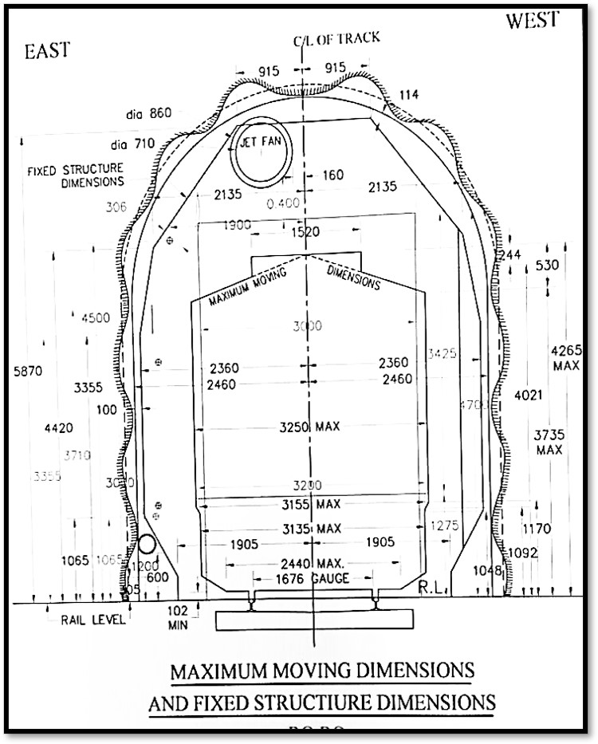

# Rescue and Restoration in Railway Tunnels

## Overview

<p align="center">
  
</p>

<p align="center">
  <b>Rescue and Restoration Operations in Railway Tunnels</b>
</p>

This project presents a study and engineering approach for **rescue and restoration during railway tunnel accidents**, with particular focus on the operational challenges faced in confined tunnel environments.

The work covers:

- Human rescue from railway tunnels
- Rope-based rescue techniques
- A proposed permanent **I-beam rescue system**
- Recovery and restoration of derailed rolling stock
- Tunnel-specific disaster-management equipment
- Safety, structural, and operational considerations

---

## Problem Statement

Railway tunnel accidents are difficult to manage because of:

- Restricted access and escape routes
- Poor lighting and visibility
- Limited ventilation
- Communication and signal-loss problems
- Restricted working space
- Difficulty in transporting conventional heavy rescue equipment
- Damage to tracks and tunnel infrastructure
- Difficulties in rerailing and removing damaged rolling stock

Therefore, rescue systems used inside tunnels need to be **compact, reliable, deployable, and adapted to confined spaces**.

---

## Project Objectives

1. Study the challenges associated with railway tunnel accidents.
2. Review disaster-management and rescue equipment used by Indian Railways.
3. Develop and evaluate rope-based tunnel rescue methods.
4. Investigate a permanent I-beam-based rescue arrangement.
5. Study methods for recovery of derailed rolling stock.
6. Improve tunnel rescue preparedness and reduce response time.
7. Develop practical solutions suitable for constrained railway tunnel environments.

---

# 1. Tunnel Rescue Concept

The project considers a coordinated rescue approach in which trained personnel use suitable anchoring, ropes, stretchers, hauling systems, and other rescue equipment to evacuate casualties from difficult tunnel locations.

<p align="center">
  
</p>

The proposed approach considers the limitations of conventional rescue machinery and emphasizes equipment that can be transported and operated inside confined spaces.

---

# 2. Rope Rescue

**Temporary and Deployable System**

<p align="center">
  <a href="https://github.com/kartik6388k-tech/Tunnel-Rescue-and-Restoration-for-Railways/blob/main/Tunnel_layout.jpeg">
    
  </a>
</p>

### Tunnel Layout

The tunnel layout illustrates the spatial arrangement considered for the rescue operation and provides the basis for understanding access, movement, and positioning of rescue personnel and equipment inside the tunnel.

### Rope Rescue Method

Rope rescue provides a **flexible and deployable method** for reaching and evacuating casualties when normal access routes are unavailable.

The methodology includes:

- Establishing a secure anchor
- Installing the rescue rope system
- Controlled descent
- Securing the casualty
- Connecting the casualty to a stretcher
- Hauling or lowering the stretcher
- Maintaining a belay/safety system
- Coordinating the rescue team

### Rope and Stretcher Arrangement

<p align="center">
  
</p>

### Key Considerations

- Rope selection and strength
- Anchoring arrangements
- Load capacity
- Mechanical advantage
- Knot and connection reliability
- Edge protection
- Communication between rescue members
- Available working space inside the tunnel

The project also considers a **human-chain technique** as a fallback option when rope-based equipment is unavailable.

---

# 3. Rope Rescue vs. Permanent I-Beam Rescue System

Both **rope rescue** and the proposed **permanent I-beam rescue system** can support casualty evacuation in railway tunnels. However, the two approaches differ in installation, flexibility, anchoring requirements, deployment, and operational characteristics.

## Visual Comparison

<table>
<tr>
<td align="center" width="50%">

### Rope Rescue

<p><b>Temporary and Deployable System</b></p>


</td>

<td align="center" width="50%">

### Permanent I-Beam Rescue

<p><b>Permanent and Fixed Support System</b></p>


</td>
</tr>
</table>

---

## Comparison

| Parameter | Rope Rescue | Permanent I-Beam Rescue |
|---|---|---|
| **System Type** | Temporary rescue system | Permanent rescue-support system |
| **Installation** | Installed during rescue operation | Installed in advance at selected tunnel locations |
| **Mobility** | Highly portable | Fixed installation |
| **Anchoring** | Requires suitable temporary or natural anchors | Uses a fixed structural support |
| **Flexibility** | High flexibility | Location-specific |
| **Deployment** | Requires setup by trained rescue personnel | Provides a pre-installed support point |
| **Equipment** | Ropes, anchors, carabiners, pulleys, stretcher, etc. | I-beam support with suitable rescue equipment |
| **Setup Requirement** | Anchor and rope system must be established | Main structural support is already installed |
| **Initial Cost** | Relatively lower | Higher due to permanent installation |
| **Maintenance** | Rescue equipment requires periodic inspection | Structural system and rescue equipment require periodic inspection |
| **Training** | Requires specialized rope-rescue skills | Requires trained personnel to operate the rescue system |
| **Adaptability** | Can be used at different locations | Suitable for selected pre-engineered locations |
| **Main Advantage** | Portable and adaptable | Provides a predictable fixed rescue-support point |
| **Main Limitation** | Anchoring and setup may be difficult in confined tunnels | Requires prior engineering, installation, inspection, and maintenance |

---

## Rope Rescue — Advantages and Limitations

### Advantages

- Portable
- Flexible
- Can be deployed at different locations
- Does not require a permanent structural installation
- Suitable for emergency situations where suitable anchoring is available

### Limitations

- Requires trained rescue personnel
- Requires suitable anchor points
- Setup is required during the rescue operation
- Confined tunnel geometry can make anchoring and movement more difficult

---

# 4. Permanent I-Beam Rescue System

A major proposed solution is a permanent rescue arrangement using **ISMB-125 structural steel beams** installed inside suitable railway tunnels.

<p align="center">
  
</p>

The purpose of the system is to provide a **pre-engineered structural support arrangement** for rescue operations and facilitate movement of a stretcher through constrained tunnel sections.

## Main Concept

The I-beam system is intended to provide:

- A fixed rescue-support structure
- More predictable load transfer
- Improved rescue accessibility
- Reduced dependence on temporary anchoring
- A scalable arrangement for selected tunnel sections

## Proposed Rescue Strategy

The permanent I-beam system is **not intended to completely replace rope rescue**.

Instead, the two systems can work together:

```text
                 TUNNEL ACCIDENT
                       │
                       ▼
              Assess Tunnel Conditions
                       │
             ┌─────────┴─────────┐
             │                   │
             ▼                   ▼
      Permanent I-Beam      No Permanent
        Available?           Support Available
             │                   │
        ┌────┴────┐              │
       YES         NO             │
        │           │             │
        ▼           └──────┬──────┘
  Connect Rescue           ▼
  Equipment to I-Beam   Establish
        │                Rope Anchor
        └────────┬───────────┘
                 ▼
          Secure Stretcher
                 │
                 ▼
          Casualty Evacuation
```

## Key Takeaway

> **Rope rescue provides flexibility and portability, whereas the proposed permanent I-beam system provides a pre-installed structural support arrangement for rescue operations at selected tunnel locations.**

Therefore, the permanent I-beam system can be considered an **additional rescue infrastructure**, while rope-based equipment continues to perform the actual casualty handling, hauling, lowering, and evacuation operations.

---

# 5. Tunnel Cross-Section and Clearance

Tunnel geometry and available clearance are critical when designing a permanent rescue system.

<p align="center">
  
</p>

The project studies tunnel clearance and the relationship between the rescue arrangement, tunnel structure, and railway operating envelope.

The cross-sectional assessment is important for ensuring that the proposed rescue infrastructure does not interfere with railway operations or required clearances.

---

# 6. Additional Project Visuals

<p align="center">
  
</p>

<p align="center">
  
</p>

These additional project images provide visual documentation related to the tunnel rescue and restoration study.

---

# 7. Rolling Stock Recovery

In addition to human rescue, the project addresses **restoration of derailed rolling stock inside or near railway tunnels**.

The study considers the use of compact and modular recovery systems because conventional large cranes may be difficult to deploy in confined tunnel environments.

The proposed material-trolley concept is intended to support movement of recovery materials and derailed rolling-stock components using a tunnel-compatible arrangement.

---

# 8. Disaster Management Equipment Studied

The project reviews equipment used for railway disaster management, including:

- Breakdown cranes
- Crawler excavators
- Backhoe loaders
- Telescopic boom road cranes
- Wheel-skate trolleys
- Dip lorries
- Hydraulic Rescue Devices (HRD)
- Hydraulic Re-railing Equipment (HRE)
- Hydraulic cutters
- Hydraulic spreaders
- Hydraulic rams
- Hydraulic combi tools
- Cutting equipment
- Stretchers
- Tripod rescue equipment
- Ropes, chains, hooks, and shackles

---

# 9. Engineering Standards and Analysis

The project refers to relevant standards and engineering criteria, including:

| Standard / Reference | Application |
|---|---|
| **EN 1891** | Low-stretch kernmantle ropes used for rescue and rope access |
| **IS 800** | General construction in steel |
| **IS 456** | Plain and reinforced concrete |
| **SOD** | Railway Schedule of Dimensions and clearance considerations |

Structural evaluation of the proposed I-beam system considers factors such as:

- Bending stress
- Deflection
- Dynamic loading
- Safety factor
- Span length
- Environmental effects
- Tunnel clearance

---

# 10. Project Workflow

```text
Tunnel Accident Scenario
          ↓
Assessment of Tunnel Conditions
          ↓
Identify Access & Rescue Constraints
          ↓
Select Rescue / Recovery Method
          ↓
Human Rescue
   ┌──────┴──────┐
   ↓             ↓
Rope Rescue   I-Beam System
   │             │
   └──────┬──────┘
          ↓
Casualty Evacuation
          ↓
Rolling Stock Recovery
          ↓
Structural & Safety Verification
          ↓
Restoration of Railway Operations
```

---

# 11. Expected Benefits

The proposed approach aims to improve:

- Rescue response time
- Safety of rescue personnel
- Casualty evacuation capability
- Accessibility in confined tunnel sections
- Predictability of rescue-support structures
- Restoration efficiency after derailments
- Tunnel disaster preparedness

---

# 12. Project Files

| File | Description |
|---|---|
| `2d_view_inside_tunnel.dwg` | 2D tunnel drawing / CAD layout |
| `I-beam and stracher.png` | I-beam and stracher arrangement |
| `README.md` | Project documentation |
| `Rope and stretcher(slag).png` | Rope and stretcher(slag) arrangement |
| `Screenshot 2025-06-17 205459.png` | Project visual |
| `Screenshot 2026-08-10 090630.png` | Overview / rescue team image |
| `Tunnel rescue concept.png` | Tunnel rescue concept |
| `Tunnel_layout.jpeg` | Tunnel layout used for the rope rescue concept |
| `WhatsApp Image 2026-08-10 at 09.32.28.jpeg` | Project visual |
| `cross-sectional view.png` | Tunnel cross-sectional view |

---

# Project Team

**Kartik Kushwaha (23ME019)**  
**Shanmukha Sri (23ME036)**

**School of Technology – Mechanical Engineering**  
**Gati Shakti Vishwavidyalaya, Vadodara**

---

# Acknowledgement

The project was developed with academic and technical guidance from the faculty, instructors, and technical staff associated with the **Indian Railway Institute of Disaster Management (IRIDM), Bengaluru**, and Gati Shakti Vishwavidyalaya.

---

# Project Report

The detailed project report contains the complete study of tunnel accidents, tunnel classification, disaster-management equipment, rope rescue, the proposed I-beam rescue system, railway disaster management, and material-trolley-based restoration.

---

# Disclaimer

This repository documents an academic engineering project and proposed rescue concepts.

Any real-world railway rescue system must be **validated, approved, tested, and implemented** according to applicable railway rules, engineering standards, safety procedures, and competent-authority requirements.
